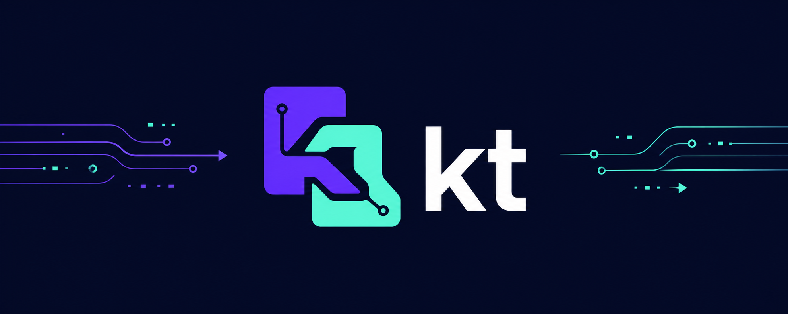

<p align="center">
  
</p>

<p align="center">
  <strong>Carry working context across AI tools, cleared chats, machines, and context windows.</strong>
</p>

<p align="center">
  <a href="https://github.com/austingregoryus/kt-skill/blob/main/LICENSE"></a>
  
  
  
</p>

# kt

`kt` turns the state inside an AI coding conversation into a small,
tool-neutral handoff stored with the project. Run `/kt` before you clear a
chat or switch tools. Run `/kt-resume` on the other side. The next agent gets
the goal, next action, decisions, dead ends, key files, git state, and just
enough mental model to continue without making you explain everything again.

It is a lightweight, durable alternative to hoping `/compact` preserves the
parts that matter.

## Why kt

- **Switch tools without starting over.** Move between Claude Code, Codex,
  ZCode, Antigravity, or any shell-capable agent using the same handoff format.
- **Spend context on the work.** Preserve the active mental model in a compact
  file instead of replaying a long chat.
- **Resume from evidence.** The handoff can include branch, working-tree state,
  recent commits, decisions, failed approaches, and the exact next action.
- **Keep control of your data.** Handoffs are local and gitignored by default.
  Sharing them with a team is an explicit project-level choice.
- **Stay portable.** The engine is one dependency-free Python file. Tool shims
  are thin Markdown skills, not separate implementations.

## Platform support

The engine and installer support Windows, macOS, and Linux with Python 3.
Installed shims call platform-native wrappers rather than assuming the command
is named `python`:

- Windows PowerShell: `& "$HOME/.kt/kt.cmd"`
- macOS/Linux: `"$HOME/.kt/kt"`

The repository includes a Windows/macOS/Linux GitHub Actions matrix plus a
POSIX install, save, list, resume, sharing, and invalid-save smoke test.

## The 20-second workflow

```text
Tool A                         Project                         Tool B
/kt fixing login redirects -> .kt/kt.md -> /kt-resume -> continue the fix
```

1. In the current tool, run `/kt` or `/kt a short headline`.
2. Clear the context, open a fresh session, or switch AI tools.
3. From the same project directory, run `/kt-resume`.
4. Continue from the recorded **Next action**.

The stable `.kt/kt.md` is always the latest handoff. Timestamped copies keep a
small, readable history.

## Install

### 1. Install the shared engine

From this repository on Windows:

```powershell
python engine/kt-install.py
# Or, when only the Python launcher is available:
py -3 engine/kt-install.py
```

On macOS or Linux:

```sh
python3 engine/kt-install.py
```

This copies the engine to `~/.kt/` and creates `kt` and `kt.cmd` wrappers.
Follow the printed PATH guidance, then restart already-open terminals and AI
tools if you want to use the short `kt` command immediately.

### 2. Install the skills for your tools

Copy both `shims/<tool>/kt/` and `shims/<tool>/kt-resume/` into that tool's
skills directory.

| Tool | Skills directory | Status and notes |
|------|------------------|------------------|
| Claude Code | `~/.claude/skills/` | Supported. Optional SessionStart auto-inject hook is included. |
| Codex | `$CODEX_HOME/skills/` or `~/.codex/skills/` | Verified in the Codex Desktop/CLI skill layout. Includes `agents/openai.yaml`. |
| ZCode | `~/.zcode/skills/` or `~/.agents/skills/` | Verified. Invoke from the Skills menu or conversationally. |
| Antigravity | `.agents/skills/` or `~/.gemini/config/skills/` | Verified conversational skill triggering. |

Detailed locations and caveats are in [shims/README.md](shims/README.md).
Tools without a shim can call `kt save` / `kt resume` after PATH refresh, or
use the absolute platform wrapper shown above.

### 3. Optional: auto-inject into Claude Code

Merge the matching example into the project's `.claude/settings.json`:

- Windows: `shims/claude/settings.hook.example.json`, replacing `<you>`
- macOS/Linux: `shims/claude/settings.hook.posix.example.json`

The hook command uses an absolute wrapper path.

The hook consumes a fresh handoff at most once and stays silent on errors. A
printed resume prompt remains the universal fallback. Whether `/clear` itself
fires SessionStart depends on the installed Claude Code version, so do not rely
on that integration without testing it locally.

## Commands

| Command | Result |
|---------|--------|
| `/kt` | Save the current task state with an inferred headline |
| `/kt some note` | Save it with a specific headline |
| `/kt-resume` | Read the latest handoff and continue |
| `/kt-resume <timestamp>` | Resume an older timestamped handoff |
| `/kt --share` | Make handoff documents eligible for git tracking |
| `/kt --local` | Return handoffs to local, gitignored mode |
| `/kt --cancel` | Cancel a pending auto-inject |
| `kt list` | List timestamped handoffs |

`kt save` refuses malformed handoffs. `Resume prompt` and `Next action` must be
the first two H2 sections, in that order, and both must contain text. Invalid
input exits with status 2 and does not create `.kt/` state.

Shared mode never stages or commits files for you. It exposes handoff documents
to normal git workflows while `.kt/.pending-handoff`, which contains a local
absolute path, remains ignored.

## What a handoff captures

```markdown
## Resume prompt
Resuming work. Read `.kt/kt.md` for the full handoff.

## Next action
Reproduce the redirect failure against the updated callback route.

## Status
- Done: traced the auth callback and added a failing regression test
- In progress: narrowing the state mismatch

## Decisions + rationale
- Keep the existing session cookie format because deployed clients depend on it

## Dead ends
- Refresh-token rotation was not the cause; logs disproved it

## Key files
- src/auth/callback.ts: failing redirect path
```

The agent authors the useful context. The engine owns deterministic file I/O,
timestamps, history, provenance, local/share mode, and resume output.

## Privacy and safety

- Local mode adds `.kt/` to the project's `.gitignore`.
- Shared mode is explicit and reversible.
- The private auto-inject sentinel stays ignored even in shared mode.
- Handoffs are plain Markdown, so you can inspect or edit them before sharing.
- Agents are instructed not to include secrets or unrelated personal data.

## Repository layout

- `engine/`: shared engine, installer, and unit tests
- `shims/`: tool-specific `kt` and `kt-resume` skills
- `SKILL.md`: portable root `kt` skill entrypoint aligned with the shared engine
- `inject-handoff.ps1` and `inject-handoff.sh`: legacy hook scripts
- `spikes/`: recorded integration probes and remaining live-tool checks
- `tests/`: hook suites and manual cross-tool acceptance scenarios

## Test

```sh
python -m unittest discover -s engine -p "test_*.py"
sh tests/inject-handoff.sh.test.sh
pwsh -NoProfile -File tests/inject-handoff.Tests.ps1
```

The automated suite covers the engine, installer, local/share behavior, resume
history, sentinel guards, and both legacy hook scripts. Live integration checks
that depend on a specific AI tool version remain documented in `spikes/` and
`tests/cross-tool-acceptance.md`.

`.github/workflows/portability.yml` runs the engine suite on Windows, macOS,
and Linux with Python 3.9 and 3.13. macOS and Linux also run the full POSIX
wrapper smoke test and shell-hook test.

## Design philosophy

The context window is temporary. Project state should not be.

`kt` does not try to archive an entire conversation. It preserves the smallest
useful bridge between "where we are" and "what happens next," in a format that
humans and agents can both read.

## License

[MIT](LICENSE)
